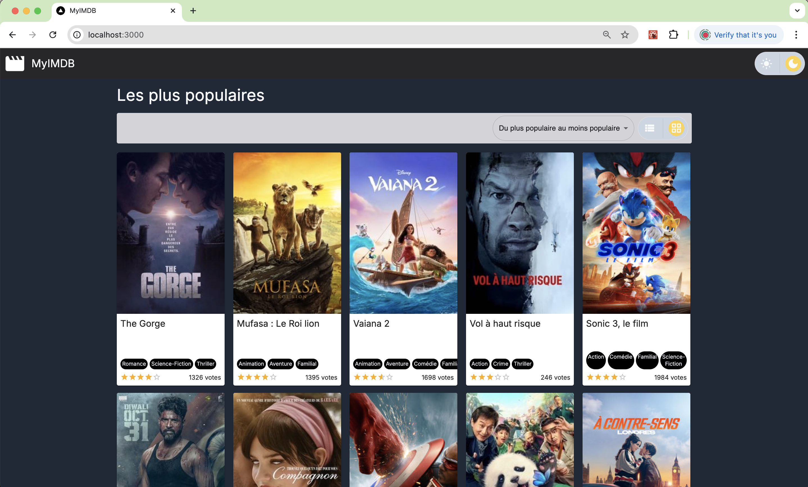
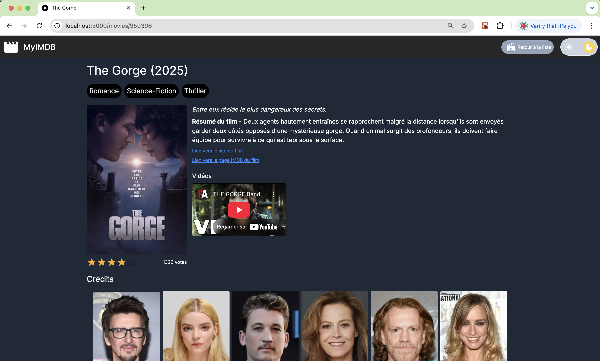
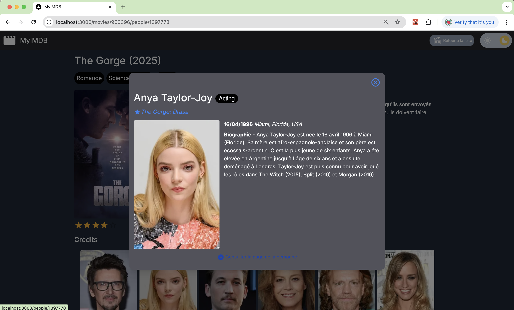
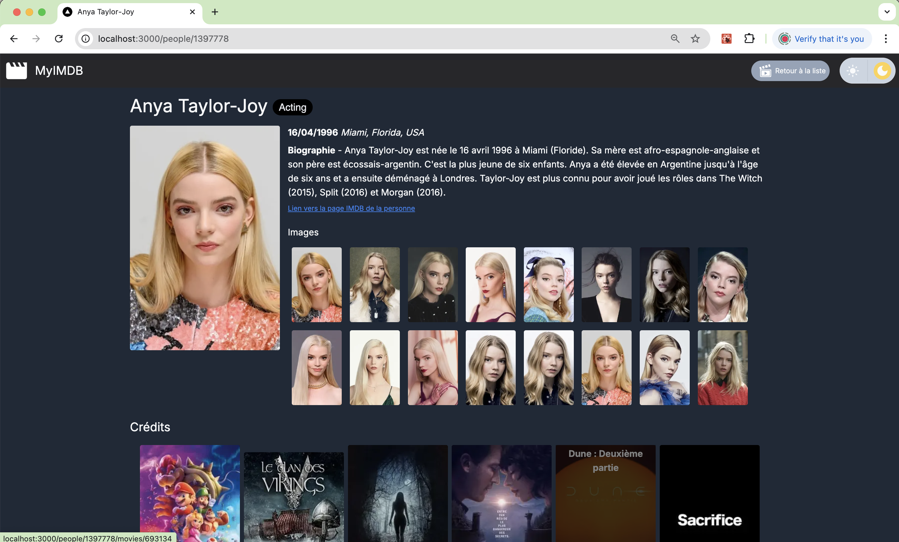
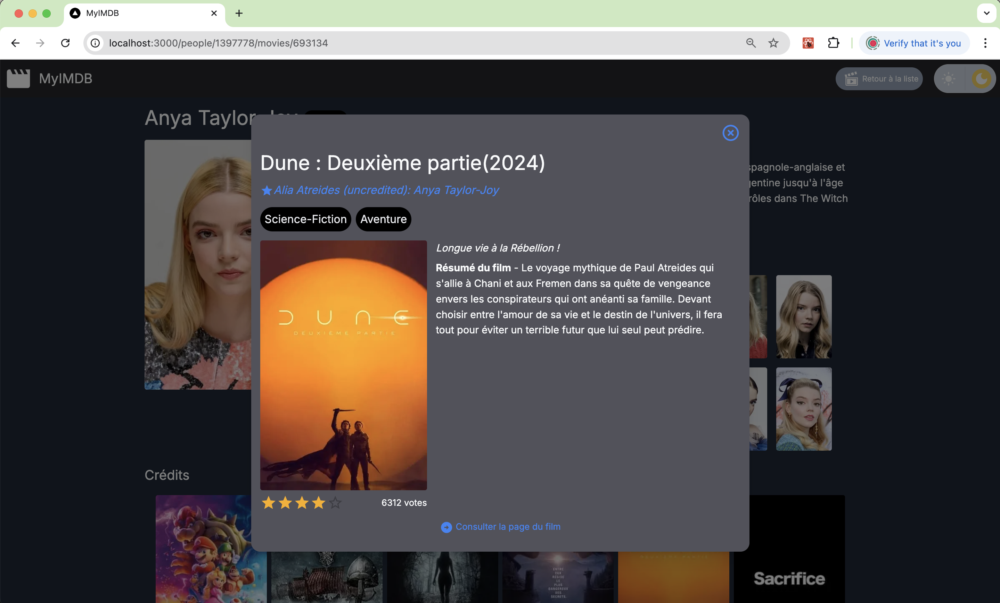

# MyIMDB - NextJS POC

## Consignes

- [Main guidelines](./docs/index.md)
- [Homepage](./docs/1-accueil.pdf)
- [Movie page](./docs/2-films.pdf)
- [Person page](./docs/3-personnes.pdf)


## Navigation

### 1. Homepage



The main route `/` makes calls to the `https://api.themoviedb.org/3/discover` API il order to list and sort paginated movies.

Play with the light / dark mode toggle button!

Play with the sorting and pagination!

Click on a  movie!

### 2. Movie page

The movie route is `/movies/<id>`

The movie page uses the `https://api.themoviedb.org/3/movie` API endpoint to fetch details about a movie, including credits (people).



When clicking on a person in the `Crédits`
- a `Modal` opens without loading a new page
- URL becomes `/movies/<id>/people/<id>`



Refreshing the page should lead to a page with the same layout showing 
- The movie in the background
- The selected person in a modal

A link in the modal makes it possible to view the page of this person.

Click on it!

### 3. Person page

The person route is `/people/<id>`

This page calls the `https://api.themoviedb.org/3/person` API endpoint to fetch details about a person, including credits (movies).



When clicking on a movie in the `Crédits`
- a `Modal` opens without loading a new page
- URL becomes `/movies/<id>/people/<id>`



Refreshing the page should lead to a page with the same layout showing 
- The person in the background
- The selected movie in a modal


## Startup

Create a `.env` file at the root of the project

```.env
API_ENDPOINT=https://api.themoviedb.org/3
API_LANG=fr-FR
API_KEY=<paste API key>
```

Then execute these commands

```.sh
pnpm install
pnpm build
pnpm start
```

Run tests with 

```.sh
pnpm test
```
